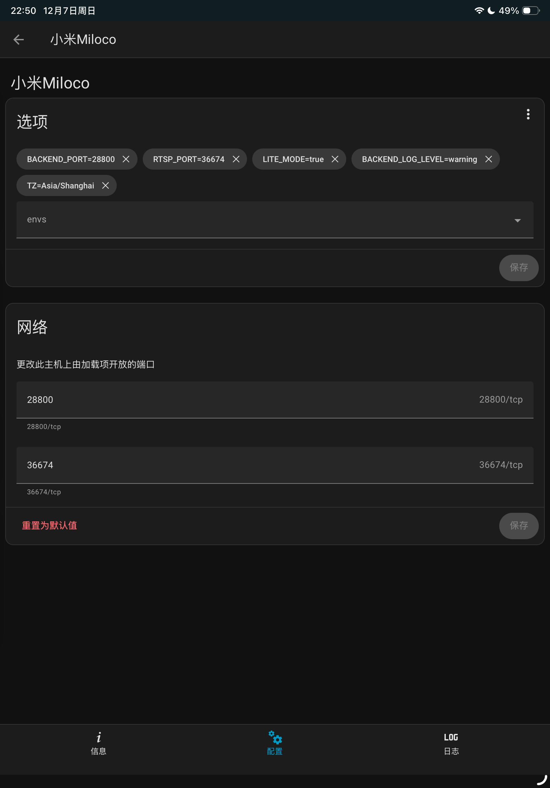

# 小米Miloco

Xiaomi Local Copilot 修改版

在官方镜像的基础上修改:
- 支持arm64架构
- 默认获取音频流
- 默认获取高清视频流
- 可以指定启用硬件加速转码
现在无需micam配合就可以获取rtsp视频流，配置好miloco后访问 rtsp://{haos的ip}:{RTSP_PORT}/{相机ID}?video_quality={清晰度}即可
例如 rtsp://192.168.0.11:36674/1123456789?video_quality=2

